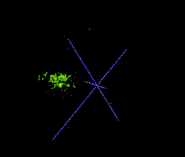

# Grad-CAM3D

application to medical data
refer to this paper
https://arxiv.org/abs/1610.02391


## Enviornment
keras 2.2.4
numpy 1.16.4


## Demo Test
you should prepare your own data before test
```console
python demo.py
```

## Result



- reference https://github.com/AdamLabISU/
